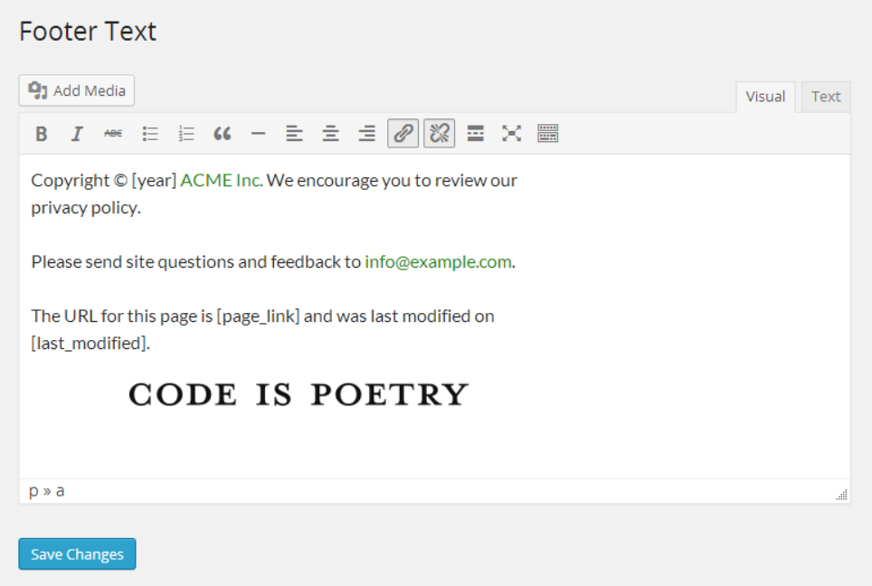

# Footer Text

* __Requires at least:__ WordPress 3.3 or later
* __Tested up to:__ WordPress 3.5.1
* __Stable version:__ [1.0](http://download.wordpress.org/plugin/footer-text.latest-stable.zip)
* __License:__ [MIT](license.txt)

Allow changing of the theme footer text easily from the dashboard

## Description

Provides an interface in the dashboard, similar to the post edit screen, that allows you to easily change the text displayed in the footer on the front-end. After installing the plugin, add the `footer_text()` template tag to your `footer.php` theme template where you want the text to display. For more options, see the [FAQ](#frequently-asked-questions).

You can use these shortcodes in the footer text editor:

* `[last_modified]` the date that the current page was last modified on
* `[page_link]` the full permalink of the current page, formatted
* `[year]` the current year eg: 2013

Visit the [plugin homepage](http://bungeshea.com/plugins/footer-text/), or review it [GitHub](https://github.com/bungeshea/footer-text/).

## Installation

1. Upload `footer-text.php` to the `/wp-content/plugins/` directory
1. Activate the plugin through the 'Plugins' menu in WordPress
1. Visit *Appearance > Footer Text* to write your awesome footer text
1. Place the `footer_text()` template tag somewhere in your theme where you want the text displayed
1. Visit site. Observe.

If you'd like to bundle this file with a theme so users don't need to install this plugin as well, copy the `footer-text.php` file to your theme's directory, and include this code in your theme's `functions.php`:

    include_once( get_template_directory_uri() . '/footer-text.php' );

Then use the `footer_text()` template tag in your theme templates.

## Frequently Asked Questions

### How can I display the footer text in my theme?
You can use the `footer_text()` function to display the footer text, or the `get_footer_text()` function to return it for use in PHP. These template tags should generally be used in the `footer.php` file of your theme.

However, if the plugin isn't active, the template tag will result in an error. To solve this, you can use this code instead:

    <?php if ( function_exists( 'footer_text' ) ) footer_text(); ?>

The `get_footer_text()` function returns the formatted footer text and accepts one parameter: `$default`, which will be returned if no text is set

The `footer_text()` function outputs the formatted footer text and accepts three parameters: `$before`, `$after` and `$default`. `$before` will be outputted *before* the text, `$after` will be outputted *after* the text, and `$default` will be used instead of the text is none is set. If no text is set `$default` is empty, nothing will be displayed.

### Can I bundle this plugin with my theme so users don't need to install this plugin?

Sure thing! Just follow the instructions in the [Installation](#installation) section.

## Screenshots

### Editing the footer text in the dashboard

### Previewing the footer text on the Twenty Eleven theme

## Changelog

### 1.0
* Initial release
